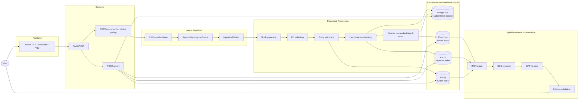

# Enterprise Document Intelligence & Distributed Hybrid RAG

## 1. Overview

Enterprise teams routinely need to search, reason over, and answer questions about complex PDF document collections without losing traceability or factual grounding. A single retrieval strategy is rarely sufficient: semantic search can miss exact identifiers, lexical retrieval can miss conceptual paraphrases, and graph reasoning can be incomplete without entity relationships. This project addresses that problem by building a document intelligence and hybrid RAG system that ingests PDFs, extracts structured evidence, indexes it across multiple retrieval channels, and returns grounded answers with citations.

The result is a system designed for enterprise document Q&A where the answer must be auditable, explainable, and tied to the source material rather than generated from unsupported assumptions.

---

## 2. What the system does

The implemented system provides end-to-end document intelligence for PDF workflows:

- PDF upload through the frontend and API
- asynchronous ingestion with HTTP 202 responses
- document parsing and layout preservation
- PII redaction before downstream extraction and retrieval
- entity extraction and document structure understanding
- deterministic, layout-aware chunking
- embedding generation for semantic retrieval
- hybrid retrieval across vector, BM25, and graph sources
- result fusion using Reciprocal Rank Fusion (RRF)
- reranking through BGE to prioritize the best evidence
- grounded answer generation with GPT-4o mini
- citation generation and citation validation
- structured logging and correlation IDs for request and job traceability
- document status tracking, cancellation, retries, and deletion cleanup
- evaluation using a golden dataset and RAGAS-style retrieval/answer metrics

---

## 3. Architecture

The architecture below reflects the implementation currently present in the repository.

---

## 4. End-to-end data flow

### Ingestion

1. The user uploads a PDF through the frontend or API.
2. FastAPI validates the payload and creates document metadata and job state in PostgreSQL.
3. The ingestion job is queued through `JobQueueInterface` and executed by `AsyncInMemoryJobQueue`.
4. `IngestionWorker` advances through parsing, redaction, extraction, chunking, embedding, and indexing stages.
5. The authoritative Postgres data model stores document metadata, job state, and chunk records.
6. Derived retrieval stores are updated from that source data:
   - Pinecone receives vector embeddings
   - Neo4j receives graph/relationship data
   - BM25 receives lexical search index entries
7. The document becomes queryable when the ingestion job reaches terminal success.

### Query

1. The user submits a natural-language question.
2. FastAPI routes the question into the retrieval and generation workflow.
3. Retrieval runs on three channels in parallel:
   - vector search for semantic similarity
   - BM25 for lexical and exact term matching
   - Neo4j for entity and relationship-aware context
4. Results are fused with Reciprocal Rank Fusion (RRF).
5. BGE reranks the fused candidate set.
6. The top evidence is passed to GPT-4o mini with instructions to answer only with the provided context.
7. The final response includes citations and citation validation checks.

---

## 5. Technology stack

| Component | Technology | Purpose |
| --- | --- | --- |
| Frontend | React 19 + TypeScript + Vite | Document upload and search experience |
| Backend API | FastAPI | REST API and orchestration |
| Async processing | `JobQueueInterface` + `AsyncInMemoryJobQueue` | Background ingestion and lifecycle management |
| PDF parsing | Docling | Layout-aware PDF extraction |
| Redaction | custom PII redaction logic | Remove sensitive values before retrieval |
| Entity extraction | domain extraction pipeline | Extract people, organizations, dates, and relationships |
| Chunking | layout-aware chunker | Preserve document structure while splitting content |
| Embeddings | OpenAI `text-embedding-3-small` | Dense semantic representations |
| Source of truth | PostgreSQL | Document metadata, chunks, and job state |
| Vector retrieval | Pinecone | Semantic nearest-neighbor retrieval |
| Graph retrieval | Neo4j | Entity and relationship retrieval |
| Keyword retrieval | BM25 | Exact and lexical matching |
| Fusion | RRF | Integrate vector, BM25, and graph results |
| Reranking | BGE reranker | Reorder fused evidence before generation |
| Generation | GPT-4o mini | Grounded answer synthesis |
| Citation validation | validation pipeline | Verify answer claims against retrieved evidence |
| Logging | structured JSON logs | Operational traceability |
| Correlation tracking | correlation IDs | Request and job linkage |
| Tracing | LangSmith | Observability and debugging support |
| Evaluation | golden dataset + RAGAS + metric pipeline | Retrieval and answer quality assessment |

---

## 6. Why hybrid RAG

Hybrid retrieval is a deliberate architectural choice rather than a convenience feature.

- Vector search is strong for semantic similarity, but it can overlook exact names, numbers, legal clauses, or identifier-heavy passages.
- BM25 is strong for lexical matching and exact token overlap, but it can miss conceptual paraphrases.
- Neo4j is useful for entity-centric and relational context, but it is not enough on its own for full document understanding.

By combining these channels, the system improves recall and evidence coverage while reducing the blind spots that a single retrieval mode typically introduces. The fused candidate set is then reranked with BGE to prioritize the most relevant evidence before generation.

---

## 7. Grounding, citations, and safety

The answer generation flow is designed to be evidence-grounded and traceable.

- Retrieval is restricted to relevant evidence from the selected documents.
- The LLM is instructed to answer only from that evidence context rather than from general prior knowledge.
- The response includes citations tied to document, page, and section-level evidence.
- Citation validation checks whether the claims in the generated answer match the evidence that was retrieved.
- If the evidence is weak or insufficient, the system narrows or refuses the answer instead of fabricating a confident response.
- PII redaction removes sensitive values before retrieval and generation.
- Secrets are stored in environment variables rather than hardcoded in the codebase.

This is a practical guardrail layer for enterprise document intelligence, but it is not a substitute for formal enterprise identity, access control, or governance systems.

---

## 8. Async ingestion and reliability

The ingestion workflow is asynchronous by design.

- `POST /documents` returns HTTP 202 Accepted after job creation.
- The backend records document and ingestion state in PostgreSQL.
- The ingestion work runs in the background using `IngestionWorker`.
- Status is tracked per document and job lifecycle for progress visibility.
- Cancellation is supported for queued or in-progress work.
- Retry handling covers transient failures during indexing or processing.
- Deterministic chunk IDs reduce duplicate or inconsistent chunk lifecycle behavior.
- Idempotency is part of the job and indexing model to prevent repeated or conflicting writes.
- Deletion cleanup ensures document-scoped retrieval artifacts are removed when a document is removed.
- The frontend also includes state-management protections to avoid stale async refreshes overwriting newer state.

---

## 9. Data consistency

The project uses a source-of-truth design for data integrity.

- PostgreSQL holds authoritative document metadata, chunk records, and ingestion state.
- Pinecone, Neo4j, and BM25 are derived retrieval structures built from that authoritative source.

This is important because it allows the system to rebuild retrieval indexes or recover from partial drift by rehydrating the retrieval ecosystem from Postgres rather than relying on a fragile, detached storage model.

---

## 10. Evaluation and observability

The repository includes a practical evaluation and observability layer.

### Evaluation

The implemented evaluator supports:

- Precision@K
- Recall@K
- MRR
- NDCG@K
- retrieval latency tracking
- golden dataset evaluation
- RAGAS-style metrics such as faithfulness, answer relevance, and context quality
- citation correctness checks
- channel-level retrieval metrics across vector, BM25, graph, and RRF

The evaluation flow uses the repository’s golden dataset and evaluator modules rather than claiming a fixed benchmark outcome.

### Observability

The implementation includes:

- structured JSON logging
- correlation IDs for requests and jobs
- pipeline tracing hooks
- LangSmith integration for observability and debugging
- document and job status tracking for operational visibility

---

## 11. Testing

The repository includes a valid test and verification workflow for the implemented frontend behavior and build path.

### Verified results

- Frontend tests: 18/18 passing
- Frontend production build: succeeded

These results were validated in the current workspace and reflect the implemented frontend behavior. The project does not claim additional backend totals beyond the code and the explicit frontend verification above.

---

## 12. Performance

This system is validated in a local-development environment rather than in a production deployment environment.

- BGE reranking can contribute meaningful latency depending on the document size and retrieval volume.
- End-to-end latency depends on document length, embedding workload, and query complexity.
- This project does not claim production throughput or SLO guarantees beyond local validation.

The performance story is therefore honest and bounded to the implementation that is actually present in the repository.

---

## 13. Production evolution / deferred work

The following are appropriate production-evolution items and are not part of the current implementation:

- durable external queue infrastructure such as Redis, SQS, or Cloud Tasks
- object storage such as R2 or S3 for document blobs
- horizontal worker scaling and multi-instance deployment
- production deployment automation and runtime orchestration
- authentication and authorization controls
- rate limiting and abuse protection
- centralized production metrics, dashboards, and alerting
- full enterprise governance and audit controls

These remain important for future production maturity, but they are not part of the current release scope described here.

---

## 14. Project status

This project is currently implemented and functionally validated as a locally tested enterprise document intelligence and hybrid RAG system. It is designed around a clear architecture, grounded generation, and auditable retrieval, with the explicit understanding that production-grade deployment infrastructure remains a future evolution rather than a current implementation claim.

The repository therefore presents a serious engineering implementation with a clear release boundary: the system works as a robust local/development-oriented document intelligence platform, while fully managed cloud-scale deployment and governance remain deferred to a later production phase.

---

## 15. Quick start

This repository is intended for a developer environment and the startup flow depends on local environment configuration rather than a single universal command sequence. The project uses the repository’s existing configuration files and scripts for local setup and execution. The README intentionally does not prescribe a generic startup command sequence that would be inaccurate across varied local environments.

---

## 16. Summary

This project brings together the key building blocks required for grounded enterprise document Q&A:

- asynchronous ingestion
- authoritative persistence in PostgreSQL
- semantic, lexical, and graph retrieval
- RRF fusion and BGE reranking
- grounded generation with citations and validation
- operational tracing and evaluation

It is a strong engineering implementation for local and project-level validation, and it is intentionally documented without overstating the production infrastructure that has not yet been built.
